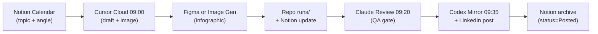

# Figma + Notion + Claude LinkedIn Integration

Operational guide for the Daily LinkedIn Marine PLM Post pipeline using **Notion** (content calendar), **Figma** (infographic design), and **Claude** (QA review).

## Pipeline overview



| Time | Automation | Tool | Action |
|------|-----------|------|--------|
| 09:00 | Cursor Cloud `daily-linkedin-marine-plm-post` | Notion MCP, Figma MCP, Image Gen | Query today's topic → draft post → create infographic → save to repo → update Notion |
| 09:20 | Codex `daily-linkedin-claude-review` | Claude (local) | Read draft from repo → image QA checklist → update Notion status |
| 09:35 | Codex `daily-linkedin-mirror-and-post` | PowerShell + LinkedIn app | Mirror to Windows → auto-post → update Notion + memory.md |

---

## Notion — Content Calendar

**Database:** [LinkedIn Content Calendar](https://app.notion.com/p/7ee8f488584e4ca290f3fcbfa3ea1314)

**Config file:** `notion-config.json` (same folder)

### Properties

| Property | Purpose |
|----------|---------|
| Topic | Display title |
| Topic Slug | Folder name (`YYYY-MM-DD/<topic-slug>/`) |
| Scheduled Date | Calendar date for posting |
| Angle | One-line angle for the post |
| Marine Context | Execution context (BOM, SATCOM, shipyard gates, etc.) |
| Status | Planned → Drafting → QA Review → Ready → Posted / Blocked |
| Image Source | Figma Template / Image Gen / Pillow Fallback |
| Image QA | QA checklist results |
| Repo Path | GitHub run folder URL |
| Windows Path | `C:\Users\namma\Documents\Codex\...` |
| Figma File | Figma template or export URL |
| LinkedIn Status | posted / ready / blocked |
| Notes | Free-form notes |

### Cursor Cloud — pre-run (09:00)

1. Read `notion-config.json` for database IDs.
2. Query Notion for today's topic:
   - SQL: `query_today_sql` with today's date (`YYYY-MM-DD`)
   - Fallback: `query_next_planned_sql` if no topic scheduled today
3. If no Notion result, fall back to `memory.md` topic rotation.
4. Set Notion status to **Drafting** when run starts.

### Cursor Cloud — post-run (09:00)

1. Set Notion status to **QA Review** (or **Ready** if QA passed inline).
2. Fill: Image Source, Image QA, Repo Path, Windows Path, Figma File (if used).
3. Append run summary to `memory.md`.

### Codex mirror — post-run (09:35)

1. After LinkedIn post (or block), set Notion status to **Posted** or **Blocked**.
2. Fill LinkedIn Status field.

---

## Figma — Infographic Design

**Account:** 이준하 (leejunha781@gmail.com) — View seat on Starter plan.

### Design template layout (solution-overview reference)

Reference-grade flat vector infographic:

- **Background:** uniform deep-navy (`#0A1628`)
- **Top:** 5–7 numbered process pipeline icon cards
- **Center:** stylized system/architecture scene (vessel, satellite, PLM nodes)
- **Left:** legend panel (operational events, status codes)
- **Right:** automation/Python sidebar
- **Bottom:** 3 summary cards + footer takeaway strip
- **Typography:** cyan section labels, white body text, amber for alert/fallback paths only
- **Icons:** flat monochrome-blue vector, consistent thin line-weight

### Image production priority

1. **Figma Template** (preferred when edit access available):
   - Open template file → populate title, pipeline steps, legend, sidebar, summary cards
   - Export PNG at 1200×1500 or 1080×1350 (LinkedIn portrait)
   - Save as `<topic-slug>-infographic.png`
2. **Figma MCP `generate_figma_design`** (when template file exists):
   - Capture reference layout into existing Figma file
3. **Built-in Image Gen** (fallback — current default):
   - Apply Reference-grade flat vector style rule from prompt.md
4. **Pillow/PowerShell** (last resort only)

### View-seat limitation

Current Figma seat is **View only**. To use Figma as primary image source:
- Upgrade to Edit seat, OR
- Share template file with edit access to the MCP-connected account
- Until then: use Image Gen with solution-overview style rules (proven in test runs)

### Figma file placeholder

When a template file is created, record its URL in:
- `notion-config.json` → add `figma_template_url`
- Notion calendar row → Figma File property

---

## Claude — QA Review Gate

**Automation:** `.codex/automations/daily-linkedin-claude-review/` (09:20 daily)

**Prompt:** `claude-review-prompt.md`

### Review checklist

Claude reads the latest run from repo `runs/YYYY-MM-DD/<topic-slug>/` and checks:

1. **Post quality:** consultative tone, marine execution context, 3 application points, 5–8 hashtags
2. **Image QA:** text-fit, leader-lines, overlap, photo-diversity (8/8 if applicable)
3. **Professional grade:** reference-grade flat vector style, not childish/cartoon
4. **Notion sync:** update status to Ready (pass) or Blocked (fail with reason)

### Memory sync

After review, append to:
- `.codex/automations/daily-linkedin-marine-plm-post/memory.md`
- Claude `MEMORY.md` (via `memory-sync-manual` if needed)

---

## Activation checklist

- [ ] Notion MCP authenticated in Cursor Desktop
- [ ] Figma MCP authenticated in Cursor Desktop
- [ ] Claude Desktop running with git autosync on Windows
- [ ] Cursor automation tools: Memories, Computer use, **Notion**, **Figma**
- [ ] Codex `daily-linkedin-claude-review`: daily 09:20, ACTIVE
- [ ] Codex `daily-linkedin-mirror-and-post`: daily 09:35, ACTIVE
- [ ] LinkedIn Content Calendar seeded with upcoming topics

## Sync commands (Windows)

```powershell
cd $env:USERPROFILE\.cursor\automations
.\sync-both-linkedin-automations.ps1
.\validate-daily-linkedin-automation.ps1
```
